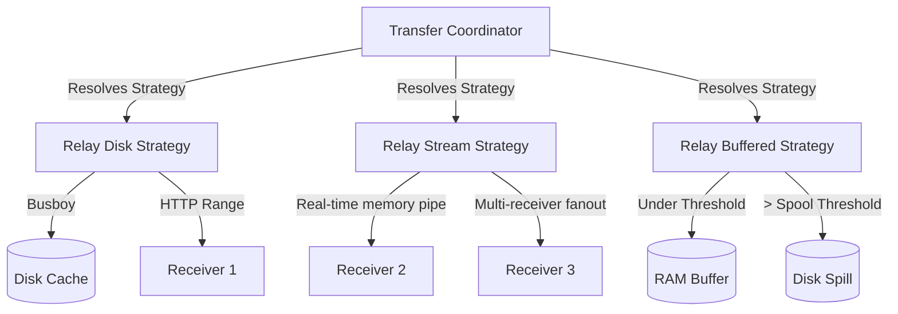
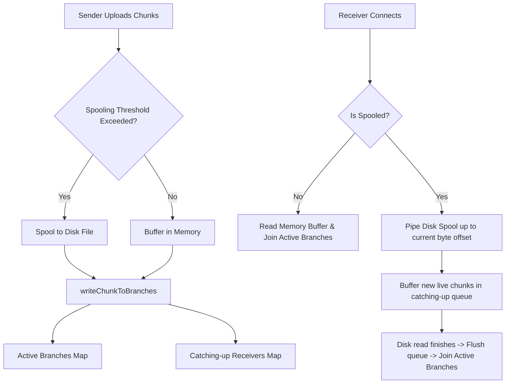

# JAVIN FileShare — High-Performance LAN File Sharing

[](https://github.com/venkatbayanaboina/Javin-Share-/actions)
[](https://opensource.org/licenses/MIT)
[](https://nodejs.org/)

**JAVIN FileShare** is a secure, high-performance local network (LAN) file-sharing platform designed for rapid, direct transfers between devices on the same Wi-Fi network or mobile hotspot. By eliminating cloud dependencies, JAVIN FileShare ensures maximum bandwidth utilization and strict data privacy—your files never leave your local physical network.

---

## Key Features

* **Multi-Platform Support**: Fully responsive web client compatible with Windows, macOS, Linux, iOS, and Android modern browsers.
* **Instant Session Joining**: Passwordless pairing via dynamically generated **PINs** and high-contrast **QR codes**.
* **Zero-Cloud Architecture**: Encrypted TLS-based transport (`HTTPS`) communicating directly between devices over the local network.
* **Large File Capacities**: Support for files up to **50 GB** and beyond, controlled dynamically by configurable upload caps.
* **Real-time Session Sync**: Real-time page coordination, lock states, download queues, and progress tracking powered by **Socket.IO**.
* **Authoritative Security**: Host-only administrative controls, automated failed PIN rate-limiting, and deep path/filename sanitization.

---

## How it Works: Core Architecture

JAVIN FileShare uses a **server-relayed transfer architecture** controlled by a dynamic **Transfer Coordinator Service**. Rather than relying on fragile WebRTC peer-to-peer handshakes which frequently fail across strict corporate routers, the platform orchestrates transfers using three optimized strategies:



### 1. Relay Disk Strategy (`relay-disk`)
* **Behavior**: Chunks are uploaded and written to disk under the temporary uploads cache using stream-based Busboy parsers.
* **Optimization**: Served to receivers using HTTP **Range-based requests**, allowing for robust partial content serving, chunk offset uploads, and transfer resumption after network disconnection.

### 2. Relay Stream Strategy (`relay-stream`)
* **Behavior**: Uploaded bytes are piped **directly and in real-time** from the sender's upload socket/request into the connected receivers' active HTTP download streams using in-memory PassThrough pipelines.
* **Optimization**: Multi-receiver fan-out with zero disk footprint and near-instantaneous starting latencies.

### 3. Relay Buffered Strategy (`relay-buffered`)
* **Behavior**: A highly optimized hybrid strategy. 
* **Optimization**: Files smaller than the `spoolThresholdBytes` are kept entirely in-memory for lightning-fast RAM-to-RAM pipelining. If a file exceeds this threshold, the strategy automatically spools and spills remaining chunks to disk on-the-fly, keeping server memory usage constant.
* **Memory Safety & Sequential Integrity (Updated)**:
  * **Lagging Queue Pattern**: Catching-up and late-connecting downloaders read spooled disk chunks first. New live chunks are queued in memory and flushed in order after catch-up is complete, preventing out-of-order chunk interleaving (file corruption).
  * **Backpressured Pipe**: Spooled disk reads use a backpressured stream pipe to pause reading if a receiver is slow.
  * **16MB Safety Hard-cap**: Automatically drops extremely stalled downloaders whose queued buffers exceed 16MB to prevent RAM exhaustion.

Here is the detailed flow diagram for the updated `relay-buffered` strategy:



---

## Directory Structure

```
Javin-Share-/
├── backend/
│   ├── server.js                 # Launcher entrypoint (boots index.js)
│   ├── src/
│   │   ├── config.js             # Shared app & strategy configuration
│   │   ├── routes/               # HTTP endpoints (health, upload, download, session)
│   │   ├── sockets/              # Socket.IO handlers & room management
│   │   ├── state/                # Store singleton (sessions, active files, download queues)
│   │   └── services/
│   │       ├── transfer/         # Coordinator & Strategies (disk, stream, buffered)
│   │       ├── session.service   # Host-client handshake & state orchestration
│   │       └── download-queue    # Multi-client queue and backpressure services
│   └── test/                     # 34-test Suite (unit & integration)
├── frontend/
│   ├── host.html                 # Host admin panel (PIN/QR generator)
│   ├── join-pin.html             # Client pin verification portal
│   ├── session.html              # Central Session file sharing hub
│   ├── send-files.html           # Sender file-staging interface
│   ├── receive-files.html        # Receiver queuing & progress interface
│   ├── session-ended.html        # Session termination interface
│   └── assets/js/                # Client ES6 Modules (core, pages, and socket drivers)
├── docs/
│   ├── FINAL_PLAN.md             # Spec audits & deferred timers implementation plan
│   ├── POST_RESTRUCTURE_ROADMAP.md # Detailed track progress and engineering logs
│   ├── PHASE_PROGRESS.md        # Checkbox-level phase progress manifest
│   ├── SECURITY.md               # LAN security model and rate-limit controls
│   └── benchmarks/               # Network performance logs & LAN benchmark configurations
├── package.json                  # Root script orchestration
├── setup.bat / setup.sh          # Native platform installer scripts
└── start.sh                      # Native platform execution scripts
```

*Note: Legacy endpoints (such as `/main.html`, `/index.html`) automatically issue **301 permanent redirects** to the correct, modern thinned functional shells.*

---

## Prerequisites

* **Node.js 18.0.0+**
* **Git** (includes OpenSSL on Windows for local self-signed TLS cert generation)

---

## Quick Start

### 1. Windows Execution
Double-click `setup.bat` (automatically provisions certs, installs modules, and spins up the server), or run:
```cmd
cd backend
npm install
node server.js
```

### 2. macOS / Linux Execution
Execute the shell launcher to automatically run configuration audits and boot:
```bash
./start.sh
```
Or run manually:
```bash
cd backend
npm install
node server.js
```

Navigate to `https://<your-host-lan-ip>:4000` (or `https://localhost:4000` on the hosting machine) in any modern browser. Accept the local self-signed SSL certificate warning to begin.

---

## Development & Verification

JAVIN FileShare enforces a strict continuous-integration quality standard. Adjust performance parameters by copying `.env.example` to `.env`.

```bash
# Install dependencies
cd backend && npm install

# Boot development environment with hot-reloading
npm run dev

# Run comprehensive 34-test suite (unit, integration, and strategy tests)
npm test

# Run isolated transfer optimization strategy tests
npm run test:opt

# Run code linters (ESLint)
npm run lint

# Audit source formatting (Prettier)
npm run format:check
```

---

## Configuration Variables

| Variable | Type | Default | Description |
|----------|------|---------|-------------|
| `PORT` | `Number` | `4000` | Local network HTTPS port. |
| `MAX_FILE_SIZE_BYTES` | `Number` | `53,687,091,200` | Strict file upload cap (default: 50 GiB). |
| `PIN_MAX_ATTEMPTS` | `Number` | `8` | Failed verification attempts permitted before lockout. |
| `TRANSFER_DEFAULT_STRATEGY` | `String` | `'relay-disk'` | Default fallback transfer mode (`relay-disk`, `relay-buffered`). |
| `TRANSFER_ENABLE_STREAM_RELAY`| `Boolean`| `false` | Set `true` to enable pipe-through stream modes. |
| `TRANSFER_SPOOL_THRESHOLD_BYTES`| `Number`| `268,435,456` | Spool boundary for buffered strategy (default: 256 MiB). |

---

## Security Model

JAVIN FileShare is optimized for **trusted local area networks** (such as home, small-office, or closed private networks). 
* **Dynamic Timer Controls**: Countdown redirects and grace windows are authoritative and held securely on the server.
* **Administrative Controls**: Grace shutdowns are host-restricted and authenticated at the socket/session level.
* **Malicious Input Defense**: Paths, names, and identifiers are deeply validated against traversal payloads.

For full detail, refer to the [LAN Security Manifest (docs/SECURITY.md)](docs/SECURITY.md).

---

## License

This project is licensed under the MIT License — see the [LICENSE](LICENSE) file for details.
