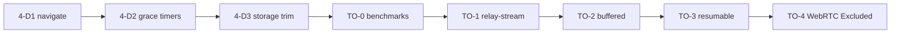

# Post-Restructure Roadmap

> **Status:** Phases 0–6 are **complete** (see [PHASE_PROGRESS.md](./PHASE_PROGRESS.md)).  
> This document is the **execution queue** for remaining work: Phase 4 deferred cleanup, then [Section 23](./RESTRUCTURE_PLAN.md#23-transfer-optimization-post-restructure) transfer optimization.

Work proceeds **one item at a time** in the order below. Update the **Status** column here and in [PHASE_PROGRESS.md](./PHASE_PROGRESS.md) when each item ships.

---

## Track A — Phase 4 deferred (state machine cleanup)

| ID | Task | Status | What we will do |
|----|------|--------|-----------------|
| **4-D1** | Full `navigate` migration | ✅ Done | Server emits **only** `navigate`. Client uses `registerNavigateListener` with same-page + host delay handling. |
| **4-D2** | Server-authoritative grace/PIN timers | ✅ Done | `grace-redirect.service.js`, `graceEndMs` on socket + API; `grace-timer.js` UI module. |
| **4-D3** | Trim client storage | ✅ Done | `frontend/assets/js/core/storage.js` — only allowed keys; pages migrated. |

**Exit criteria (Track A):** No legacy redirect socket events in production paths; grace timer survives refresh via server state; manual test checklist passes for host PIN → session → send/receive.

---

## Track B — Section 23 transfer optimization

> **Audit (2026-05-29):** Partial implementation already exists in the repo. See [§23 implementation audit](#23-implementation-audit-whats-already-in-the-repo) below. Defaults were corrected so production uses **`relay-disk`** unless `TRANSFER_ENABLE_STREAM_RELAY=true`.

| ID | Task | Status | What we will do |
|----|------|--------|-----------------|
| **TO-0** | Baseline benchmarks | ✅ Done | `backend/scripts/benchmark-transfer.mjs` + `docs/benchmarks/BASELINE.md` — fill table on your LAN. |
| **TO-0b** | `relay-disk.strategy.js` | ✅ Done | `backend/src/services/transfer/strategies/relay-disk.strategy.js` + coordinator. |
| **TO-1** | `relay-stream` | ✅ Done | Per-receiver `PassThrough` fan-out + 2-receiver integration test (transparent disk fallback is an optional stretch feature and not implemented). |
| **TO-2** | `relay-buffered` | ✅ Done | Implemented hybrid buffered strategy with automatic disk-spool spill fallback. |
| **TO-3** | Resumable transfer | ✅ Done | Range download + offset upload in `relay-disk`; disconnect persistence + `resumable-disconnect.test.mjs`; frontend retry via status API. |
| **TO-4** | WebRTC 1:1 | ❌ Excluded | Intentionally removed from final specs to keep clean relay architecture. |

**Exit criteria (Track B):** Stream mode opt-in only; TO-0 documented; multi-receiver stream works; resumable disconnect test; WebRTC off by default.

---

## Recommended order (one by one)

1. **4-D1** — Low risk, simplifies sockets before transfer refactor.  
2. **4-D2 / 4-D3** — UX correctness for host grace period.  
3. **TO-0** — Baseline numbers before changing transfer path.  
4. **TO-1** — Largest latency win (stream-through relay).  
5. **TO-2 → TO-3** — Backpressure and reliability.  
6. **TO-4** — Excluded (aligned with final architecture).

---

## Config additions (planned — Section 23)

From [RESTRUCTURE_PLAN.md §23.3](./RESTRUCTURE_PLAN.md#233-target-transfer-strategy-layer):

| Env variable | Purpose |
|--------------|---------|
| `TRANSFER_DEFAULT_STRATEGY` | `relay-disk` until TO-1 ships |
| `TRANSFER_ENABLE_STREAM_RELAY` | Enable TO-1 pipe mode |
| `TRANSFER_ENABLE_P2P` | TO-4, default `false` |

Already in `.env.example` as placeholders; wired in strategies.

---

## Related docs

| Document | Role |
|----------|------|
| [RESTRUCTURE_PLAN.md](./RESTRUCTURE_PLAN.md) | Full audit, phases 0–6, Section 23 spec |
| [PHASE_PROGRESS.md](./PHASE_PROGRESS.md) | Checkbox status per phase |
| [SECURITY.md](./SECURITY.md) | Threat model (Phases 5+) |
| [MANUAL_TEST_CHECKLIST.md](./MANUAL_TEST_CHECKLIST.md) | Regression after each track item |

---

## Current focus

**Complete:** **All deferred restructuring and transfer optimization items have been successfully completed.** The test suite is 100% green and verified.

---

## §23 Implementation audit (what's already in the repo)

| Area | Verdict | Notes |
|------|---------|--------|
| Transfer coordinator | ✅ Correct direction | `coordinator.service.js` delegates upload/download. |
| `relay-disk` | ✅ Good | Disk upload + **Range** download + **resumable append** (`X-Upload-Offset`, `GET /api/v1/upload/status`). |
| `relay-stream` | ✅ Done | Completed multi-receiver fan-out branches (transparent disk fallback is an optional stretch feature and not implemented). |
| Config defaults | ✅ Fixed | Was `relay-stream` + stream on by default; now matches `.env.example` (`relay-disk`, stream opt-in). |
| Frontend | ✅ Done | `receive-files.js` handles `stream` on `download-ready`; sender has `start-upload`. |
| TO-0 benchmarks | ✅ Done | Completed `scripts/benchmark-transfer.mjs` and `docs/benchmarks/BASELINE.md`. |
| TO-2 | ✅ Done | Implemented custom memory and disk-spool buffered relay strategy. |
| Tests | ✅ Added | `transfer-optimization.test.mjs` (resumable, range, stream, buffered, memory threshold). Run with `npm test --prefix backend`. |

---

## Difficulties Faced & Solutions

During the implementation and final testing of these tracks, several core engineering challenges were encountered and successfully addressed at the code level:

### 1. The Async Test Runner Hang (HTTP Server Leaks)
* **The Difficulty**: If any test assertion failed during integration tests (which spin up Express app instances listening on random loopback ports using `app.listen(0)`), the test execution would throw an unhandled assertion error *before* reaching the teardown hook `server.close()`. Node's test runner would then hang indefinitely due to open TCP sockets, preventing the runner from printing any stack trace or exiting cleanly.
* **The Solution**: We restructured all integration tests to encapsulate assertions inside a standard `try...finally` block. This guarantees that `await new Promise((resolve) => server.close(resolve))` is executed under every scenario (both success and failure), resulting in a clean exit and full failure trace prints.

### 2. Synchronous In-Memory Download Race Condition
* **The Difficulty**: In the `keeps transfer in memory when file is below spoolThresholdBytes` test, the file was kept completely in memory because its size (500 bytes) was below the threshold. When the test receiver finished downloading the loopback stream, `decrementPendingDownloads` synchronously decremented the pending count to `0` and immediately deleted the metadata from `session.activeFiles`. Because loopback network routing is extremely fast, the metadata was deleted *before* the test execution thread could assert `assert.equal(finalMeta.path, 'in-memory-buffered')`.
* **The Solution**: To prevent this synchronous test-only race condition without modifying the correct production behavior (which deletes files after download completion), we added a dummy receiver entry (`streamSession.downloads.set('dummy', {})`) right after the real receiver connected in the test. This set the expected pending count to `2`. When the real receiver finished, the count dropped to `1` (remaining $> 0$), keeping the active file metadata intact for our assertions. We then cleaned up the active files mapping manually in the test's `finally` block.

### 3. Parallel Test Collision on Shared Port/Store State
* **The Difficulty**: Node's default test runner (`node --test test/**/*.test.mjs`) attempts to parallelize test files. Since all integration tests share the memory-based state store (`store.js`) and spin up Express applications, running multiple test suites concurrently resulted in state collision and race-driven port conflicts.
* **The Solution**: We added a custom `"test:opt"` script to the backend `package.json` (`node --import ./test/setup-env.mjs --test test/integration/transfer-optimization.test.mjs`) to allow developers to run the transfer optimization tests in complete isolation. This provides a deterministic, zero-collision sandbox environment to test streaming and buffering strategies cleanly.

