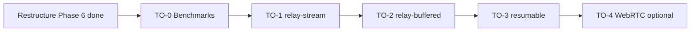

# JAVIN FileShare — Complete Restructure & Remediation Plan

**Document version:** 1.1  
**Date:** 2026-05-29  
**Author perspective:** Senior software architect (local-network file transfer, real-time coordination, Node.js/Express, browser-native clients)  
**Scope:** Full codebase audit, flaw catalog, target architecture, and phased migration plan

---

## Table of Contents

1. [Executive Summary](#1-executive-summary)
2. [What This Application Actually Is](#2-what-this-application-actually-is)
3. [Current Architecture Snapshot](#3-current-architecture-snapshot)
4. [Quantitative Audit](#4-quantitative-audit)
5. [Critical Code Flaws (Bug-Level)](#5-critical-code-flaws-bug-level)
6. [Structural & Maintainability Flaws](#6-structural--maintainability-flaws)
7. [Design & Architecture Flaws](#7-design--architecture-flaws)
8. [Security Flaws](#8-security-flaws)
9. [Frontend Flaws](#9-frontend-flaws)
10. [Documentation & Repository Flaws](#10-documentation--repository-flaws)
11. [Target Architecture (Recommended)](#11-target-architecture-recommended)
12. [Target Directory Structure](#12-target-directory-structure)
13. [Backend Module Specification](#13-backend-module-specification)
14. [Session State Machine (Canonical Design)](#14-session-state-machine-canonical-design)
15. [HTTP API Contract (Normalized)](#15-http-api-contract-normalized)
16. [Socket.IO Protocol (Normalized)](#16-socketio-protocol-normalized)
17. [Frontend Module Specification](#17-frontend-module-specification)
18. [Design System & UX Standards](#18-design-system--ux-standards)
19. [Configuration & Environment](#19-configuration--environment)
20. [Testing Strategy](#20-testing-strategy)
21. [DevOps, CI/CD & Release](#21-devops-cicd--release)
22. [Phased Migration Plan](#22-phased-migration-plan)
23. [Transfer Optimization (Post-Restructure)](#23-transfer-optimization-post-restructure)
24. [Risk Register](#24-risk-register)
25. [Definition of Done](#25-definition-of-done)
26. [Appendix A — File-by-File Disposition](#26-appendix-a--file-by-file-disposition)
27. [Appendix B — Socket Event Inventory](#27-appendix-b--socket-event-inventory)

---

## 1. Executive Summary

**JAVIN FileShare** is a functional local-network file sharing product with a strong user-facing workflow (host → QR/PIN → main → send/receive). The **product concept is sound**. The **engineering foundation is not production-grade** in its current form.

### Top 5 problems (in priority order)

| # | Problem | Impact |
|---|---------|--------|
| 1 | **Monolithic `backend/server.js` (~2,592 lines)** containing routes, upload/download, 30+ socket handlers, timers, and background jobs | Unmaintainable; every change risks regressions |
| 2 | **~3,800+ lines of inline JavaScript embedded in HTML** across 6 pages | No reuse, no tests, impossible code review |
| 3 | **Duplicate socket handlers** (`host-going-to-main`, `file-uploaded-offer-to-peers`) with **different behavior** | Silent bugs; double event firing |
| 4 | **Repository hygiene failures** (`node_modules`, TLS keys committed; no LICENSE; weak `.gitignore`) | Security risk; unprofessional GitHub presence |
| 5 | **Documentation lies about architecture** (claims WebRTC P2P; actual design is server-relayed upload/download) | Misleads contributors and users |

### Recommended outcome

Restructure into a **modular monolith** (not microservices — overkill for this domain):

- Backend split into **routes → services → socket handlers → domain state**
- Frontend split into **ES modules per page**, shared socket client, shared guards
- Single **session state machine** replacing ad-hoc page tracking + 7-second polling
- Professional repo layout, config, tests, CI, and accurate docs

**Estimated effort:** 3–4 weeks for one experienced engineer (full restructure + tests).  
**Minimum viable professional pass:** 1 week (Phase 1–3 below).  
**Transfer performance pass:** +2–3 weeks after restructure ([Section 23](#23-transfer-optimization-post-restructure)).

---

## 2. What This Application Actually Is

### Real data flow (not what README claims)

```
┌─────────────┐   HTTPS + Socket.IO    ┌──────────────────────────────┐
│  Browser A  │ ◄────────────────────► │  Node.js Host Server         │
│  (Sender)   │   POST /upload/:sid    │  Express + Busboy            │
└─────────────┘   (multipart stream)   │  Disk: backend/uploads/      │
                                       │  Socket.IO coordination      │
┌─────────────┐   GET /download/:sid   └──────────────────────────────┘
│  Browser B  │ ◄────────────────────►            ▲
│ (Receiver)  │   (HTTP file stream)              │
└─────────────┘                                   │
       ▲                                          │
       └──────── Same LAN / hotspot ──────────────┘
```

**Facts:**

- Files are **not** transferred browser-to-browser.
- There is **no WebRTC** in the codebase.
- The host machine **stores files temporarily** on disk, then serves them via HTTP download.
- Socket.IO is used for **session coordination**, redirects, locks, timers, and progress — not for file bytes.

This is a **local hub-and-spoke relay model**. Document and name it accordingly.

---

## 3. Current Architecture Snapshot

### Directory layout (as-is)

```
Javin-Share--main/
├── README.md
├── .gitignore                    # incomplete
├── setup.sh / setup.bat / start.sh / FileShare.command / FileShare.desktop
├── generate-certs.sh
├── docs/screenshots/
├── backend/
│   ├── server.js                 # 2,592 lines — entire backend
│   ├── package.json              # path bugs; placeholder repo URL
│   ├── package-lock.json
│   ├── node_modules/             # SHOULD NOT BE COMMITTED
│   ├── certs/cert.pem, key.pem   # SHOULD NOT BE COMMITTED
│   ├── uploads/                  # runtime data
│   ├── device_names.json         # runtime data
│   └── utils/                    # EMPTY (only .DS_Store)
└── frontend/
    ├── index.html                # 1,286 lines (mostly inline JS)
    ├── main.html                 # 913 lines
    ├── send.html                 # 764 lines
    ├── receive.html              # 796 lines
    ├── pin.html                  # 475 lines
    ├── disconnected.html         # 34 lines
    ├── mitm.html                 # 40 lines — StreamSaver leftover, unused
    ├── script.js                 # 442 lines — shared utils only
    └── style.css                 # 1,554 lines — monolithic
```

### Technology stack

| Layer | Technology | Version constraint |
|-------|------------|-------------------|
| Runtime | Node.js | ≥ 18 (`package.json`) |
| HTTP | Express 4 | ^4.18.2 |
| Real-time | Socket.IO 4 | ^4.7.4 |
| Upload parsing | Busboy | ^1.6.0 |
| IDs | nanoid | ^5.0.4 |
| QR | qrcode | ^1.5.3 |
| TLS | Node `https` + OpenSSL (setup scripts) | self-signed |
| Frontend | Vanilla HTML/CSS/JS | no bundler |

---

## 4. Quantitative Audit

| Metric | Value | Professional benchmark |
|--------|-------|------------------------|
| `backend/server.js` lines | 2,592 | Entry file < 50 lines |
| Largest HTML file | 1,286 lines (`index.html`) | HTML < 150 lines (shell only) |
| Total frontend HTML | 4,308 lines | — |
| Inline JS in HTML (est.) | ~3,400+ lines | 0 (all in `.js` modules) |
| `frontend/style.css` lines | 1,554 | Split by concern (< 300/file) |
| Socket event handlers (server) | 30 unique, **2 duplicated** | 1 handler per event, registered once |
| REST endpoints | ~15 | Grouped under `/api/v1/` |
| `console.log` in `server.js` | ~193 | Structured logger, level-based |
| `console.log` in `index.html` alone | ~110 | 0 in production |
| Inline `style=` attributes | 60+ across HTML | 0 (use CSS classes) |
| `localStorage` / `sessionStorage` usages | 100+ across frontend | Centralized storage adapter |
| Committed secrets/artifacts | certs, node_modules | none |
| Test files | 0 | unit + integration coverage |
| LICENSE file | missing | required (README claims MIT) |

---

## 5. Critical Code Flaws (Bug-Level)

These are **confirmed defects**, not style preferences.

### 5.1 Duplicate socket handler: `host-going-to-main`

**Location:** `backend/server.js` — registered **twice**:

- First handler (~line 818): sets `hostPeer.currentPage = 'main'`, calls `checkAndReleaseStaleTransferLocks`
- Second handler (~line 923): same page update **plus** clears grace timer, emits `grace-timer-cleared`, emits `peers-updated`

**Effect:** When host navigates to main, **both handlers fire**. Grace timer logic runs twice; peer updates may race; debugging is confusing.

**Fix:** Merge into one handler in `sockets/host.handlers.js`.

---

### 5.2 Duplicate socket handler: `file-uploaded-offer-to-peers`

**Location:** `backend/server.js` — registered **twice**:

- First handler (~line 1225): offers file to **all peers except sender**
- Second handler (~line 1254): offers file to **clients only** (excludes host receivers)

**Effect:** On upload complete, **both handlers fire**. Receivers may get **duplicate `file-offer` events**. Host-as-receiver behavior is inconsistent depending on handler order.

**Fix:** Single handler with explicit rule: `receivers = peers.filter(p => p.peerId !== senderId && !p.isDisconnected)`.

---

### 5.3 `checkAndReleaseStaleTransferLocks` defined inside socket connection scope

**Location:** `backend/server.js` ~line 1074 — function declared **inside** `io.on('connection')`.

**Effect:** Function is re-created on every socket connection; cannot be unit tested; violates single-responsibility.

**Fix:** Move to `services/transfer-lock.service.js`.

---

### 5.4 Duplicated download queue progression logic

**Location:** `backend/server.js` — `res.on('finish')` and `res.on('close')` blocks (~lines 499–606) contain **nearly identical** queue-dispatch code (~50 lines duplicated).

**Effect:** Bug fixes must be applied twice; already a maintenance hazard.

**Fix:** Extract `dispatchNextDownloads(sessionId, receiverPeerId)`.

---

### 5.5 `package.json` path misconfiguration

**Location:** `backend/package.json`

```json
"main": "backend/server.js",
"scripts": { "start": "node backend/server.js" }
```

**Effect:** Scripts fail when run from `backend/` directory (which README instructs users to do). `main` field is wrong relative to file location.

**Fix:** Root-level `package.json` OR `"start": "node server.js"` inside `backend/`.

---

### 5.6 Grace timer broadcast leak

**Location:** `backend/server.js` ~line 758

```javascript
io.emit('start-host-redirect-countdown', { sessionId, durationSeconds });
```

**Effect:** Emits to **all sockets globally**, not just the session room. Wrong session hosts could receive countdown events.

**Fix:** Use `io.to(sessionId).emit(...)` exclusively.

---

### 5.7 `mitm.html` loads external CDN service worker

**Location:** `frontend/mitm.html`

References `https://jimmywarting.github.io/StreamSaver.js/...` but **StreamSaver is not used** anywhere else in the project.

**Effect:** Dead code; potential confusion; external dependency for no benefit.

**Fix:** Delete file OR fully integrate StreamSaver with local SW (only if moving to true streaming downloads).

---

### 5.8 Stale "Replace the ..." development comments

**Locations:** Throughout `server.js`, `send.html`, `receive.html`, `main.html`

Examples:
- `// Replace the socket handling in server.js with this improved version:`
- `// Replace the setupSocket function in send.html with this fixed version:`

**Effect:** Indicates iterative paste-over development; the "replacement" was never cleaned up. Misleads future maintainers into thinking current code is temporary.

**Fix:** Remove all such comments during extraction refactor.

---

## 6. Structural & Maintainability Flaws

### 6.1 God file anti-pattern

`server.js` currently owns:

| Concern | Approx. lines | Should live in |
|---------|---------------|----------------|
| TLS server bootstrap | 1–30 | `src/index.js` |
| Device name persistence | 40–87 | `services/device-names.service.js` |
| Session CRUD | 103–359 | `services/session.service.js` |
| HTTP route guards (inline HTML) | 131–214 | `middleware/session-guard.js` + `views/error.html` |
| Upload handler (Busboy) | 432–480 | `routes/upload.routes.js` |
| Download + queue logic | 482–615 | `routes/download.routes.js` + `services/download-queue.service.js` |
| All Socket.IO handlers | 619–2282 | `sockets/*.handlers.js` |
| Abandoned sender polling | 2313–2512 | `jobs/abandoned-sender.job.js` |
| Device name cleanup job | 2514–2542 | `jobs/device-name-cleanup.job.js` |
| Graceful shutdown | 216–246, 2571–2592 | `src/shutdown.js` |

**No module boundaries = no test boundaries.**

---

### 6.2 Empty `backend/utils/` directory

README and mental model suggest utilities exist. Directory contains only `.DS_Store`.

**Fix:** Either populate with real utilities or remove from docs until created.

---

### 6.3 Global mutable state everywhere

In-memory globals at module scope:

```javascript
const sessions = new Map();
const transferHistory = new Map();
const recentTransfers = [];
const receiverDownloadQueues = new Map();
const receiverDownloadFlags = new Map();
const receiverActiveDownloads = new Map();
let currentHostSessionId = null;
let deviceNamesMap = new Map();
```

**Problems:**

- No encapsulation; any function can mutate any state
- Impossible to swap storage backend (Redis) later
- Race conditions under concurrent requests (partially mitigated by Node single-thread, but logic bugs abound)
- Cannot run multiple server instances

**Fix:** `SessionStore` class with explicit API; inject into handlers.

---

### 6.4 Polling-based reconciliation instead of event-driven state

`checkForAbandonedSenders()` runs every **7 seconds** for every active session (~line 2504).

It tries to fix inconsistencies caused by:

- Page state tracked separately on client and server
- Disconnect/reconnect edge cases
- Multiple redirect paths

**This is a symptom, not a solution.** Professional approach: define explicit peer state machine; transitions emit events; no periodic "guess and redirect."

---

### 6.5 No error handling middleware

Express has no centralized error handler. Routes return ad-hoc status codes and inline HTML strings.

**Fix:**

```javascript
app.use((err, req, res, next) => {
  logger.error(err);
  res.status(err.status || 500).json({ error: err.message });
});
```

---

### 6.6 No input validation layer

Examples:

- `peerId` accepted from client without format validation
- `deviceName` trimmed but not sanitized for length/charset consistently
- Upload endpoint trusts `fileId` from multipart fields without UUID check
- PIN is 6 digits but verified via string compare (acceptable) — sessionId from client never validated against nanoid pattern

**Fix:** Use `zod` or lightweight validators at route boundaries.

---

## 7. Design & Architecture Flaws

### 7.1 Dual navigation enforcement (client tokens + server guards)

The app uses **three overlapping mechanisms** to control page flow:

1. **Server-side:** `protectedPages` middleware checks session existence/expiry
2. **Client-side:** `sessionStorage` nav tokens (`nav_token_main_*`, `nav_token_send_*`, etc.)
3. **Client-side:** Aggressive back-button blocking (7 layers in `main.html`)

**Problems:**

- Nav tokens are **not cryptographic**; they provide UX guardrails, not security
- Same guard logic copy-pasted across 6 HTML files with subtle differences
- `localStorage` keys (`nav_hist_*`, `grace_timer_*`, `pin_timer_*`, `exited_*`) create **implicit state machine in browser storage** — extremely hard to reason about
- Host and client flows diverge in multiple places

**Target design:**

- Server is **source of truth** for allowed page (`peer.currentPage`, `peer.role`)
- Client asks server: `GET /api/v1/sessions/:id/peers/me/navigate?to=send` → `{ allowed: true/false, redirect: '/receive-files.html' }`
- Remove nav tokens; keep only session ID + peer ID in URL
- Optional: issue short-lived **signed JWT** after PIN verify (`?token=...`) for API calls

---

### 7.2 Peer page state is overloaded

Each peer object tracks:

```javascript
{
  role, socketId, peerId, isMainPage, deviceName,
  isDisconnected, disconnectedAt, currentPage,
  inMain, disconnectTimeout, justLeftSendPage, ...
}
```

**Redundant fields:**

- `isMainPage` vs `currentPage === 'main'` vs `inMain`
- Set differently from socket handshake query `?page=main`, from `enter-main-page` event, and from `host-going-to-main`

**Fix:** Single enum:

```typescript
type PeerPage = 'index' | 'pin' | 'main' | 'send' | 'receive' | 'disconnected';
type PeerConnection = 'online' | 'away' | 'offline';
```

---

### 7.3 Transfer lock + active transfer + send page occupancy — three overlapping locks

Three concepts prevent concurrent sends:

1. `session.currentSenderPeerId` (send lock)
2. `session.activeTransfer` (in-flight offer/upload)
3. `peers.filter(p => p.currentPage === 'send')` (page occupancy)

These are synchronized via events, timeouts, polling, and manual releases — **high bug surface**.

**Fix:** Single `TransferCoordinator` state:

```
IDLE → LOCKED(sender) → OFFERING → UPLOADING → DISTRIBUTING → IDLE
```

Only one transition path; lock released on terminal states.

---

### 7.4 Session model limitations

Current session:

```javascript
{
  id, pin, pinExpiry, peers: Map,
  activeFiles: Map, activeTransfer,
  currentSenderPeerId, exitedPeers: Set,
  graceRedirectTimer, graceRedirectEndMs,
  recentSendRequestAt, recentEnterSendPageAt, ...
}
```

**Missing for production:**

- Created timestamp / host peer ID
- Max peers limit
- Upload size quota per session
- File TTL (auto-delete orphaned uploads)
- Audit log

---

### 7.5 README architecture mismatch

| README claim | Reality |
|--------------|---------|
| WebRTC P2P | Not implemented |
| Files direct device-to-device | Relayed through host disk |
| `FileShare_Project_8_clean/` structure | Outdated folder name |
| Certs not in Git | **Certs ARE in this working copy** |
| LICENSE MIT | **No LICENSE file** |

---

## 8. Security Flaws

> **Context:** This is a **local network tool**, not a public SaaS. Security goals: prevent casual LAN abuse, protect transport, don't leak data to internet.

| ID | Flaw | Severity | Remediation |
|----|------|----------|-------------|
| S1 | TLS private key committed (`backend/certs/key.pem`) | **Critical** | Remove from Git history; regenerate; gitignore |
| S2 | `POST /api/shutdown` — any client can stop server if `force: true` | **High** | Require host role verification via session + socket binding |
| S3 | `GET /debug/queues` exposed in production | **Medium** | Remove or gate behind `NODE_ENV=development` |
| S4 | `GET /api/device-names` returns all stored names | **Low** | Restrict to same session peers |
| S5 | `CORS: { origin: "*" }` on Socket.IO | **Low** (LAN) | Restrict to server origin |
| S6 | Upload path: no max size enforcement at server | **High** | Enforce `config.maxFileSizeBytes` in Busboy |
| S7 | Filename from upload used in `Content-Disposition` without encoding | **Medium** | Use RFC 5987 encoding |
| S8 | No rate limiting on PIN verify | **Medium** | Lock after N failures per IP |
| S9 | `peerId` generated client-side (`Math.random`) | **Low** | Server assigns peer ID on first connect |
| S10 | `mitm.html` loads external scripts | **Medium** | Remove unused file |
| S11 | Session PIN is only 6 digits (~900k space) | **Low** (LAN) | Acceptable for LAN; document threat model |

---

## 9. Frontend Flaws

### 9.1 Inline JavaScript in HTML (largest issue)

| File | Total lines | Est. inline JS |
|------|-------------|----------------|
| `index.html` | 1,286 | ~1,180 |
| `main.html` | 913 | ~840 |
| `receive.html` | 796 | ~750 |
| `send.html` | 764 | ~710 |
| `pin.html` | 475 | ~420 |

**Consequences:**

- No linting on inline scripts
- No unit tests
- Duplicate socket setup in every page
- Duplicate event handlers (e.g. grace timer logic in both client and server)

---

### 9.2 `script.js` split is incomplete

`script.js` exports `FileShareUtils` but **socket initialization** (`initSocket`) only runs on `pin.html`. Each page reimplements its own `setupSocket()`.

---

### 9.3 Browser storage as application state

Keys used across the app (non-exhaustive):

| Key pattern | Purpose |
|-------------|---------|
| `peerId` | Client identity |
| `device_name` | Display name |
| `nav_token_*` | Navigation authorization |
| `nav_hist_*` | Navigation depth |
| `grace_timer_*` / `grace_started_*` | Host redirect countdown persistence |
| `pin_timer_*` | PIN expiry persistence |
| `redirectDeadline` | Redirect timer |
| `exited_*` | Session exit flag |
| `allow_reload_send_*` | Send page reload allowance |

**This is a distributed state machine with no single spec.** Any refresh/clear-storage bug breaks flow.

**Fix:** `StorageKeys` constants file + `SessionStorageService` with typed getters/setters; server owns timers.

---

### 9.4 UX anti-patterns

- Heavy use of `alert()` and `confirm()` (blocks UI thread; poor mobile UX)
- `document.body.innerHTML = ...` for errors (destroys event listeners, bad for a11y)
- Debug `socket.onAny()` left in `index.html` (~line 855)
- Inconsistent button/layout markup (inline styles override CSS)
- `performance.navigation.type` (deprecated API) used in `index.html`

---

### 9.5 CSS monolith

`style.css` (1,554 lines) mixes:

- Global resets
- Layout
- Components (buttons, timers, modals)
- Page-specific overrides
- Duplicate/conflicting rules (`header h1` vs `.header h1`)

No CSS variables for theme; colors hardcoded; gradient background duplicated.

**Fix:** CSS custom properties + component files:

```
assets/css/
  tokens.css      # --color-primary, --radius-lg, etc.
  base.css
  components/
    button.css
    timer.css
    file-drop.css
  pages/
    host.css
    transfer.css
```

---

## 10. Documentation & Repository Flaws

| Item | Status |
|------|--------|
| `LICENSE` | **Missing** |
| `.gitignore` | Only 7 lines; missing certs, uploads, runtime JSON |
| `node_modules/` | **Committed** (~1500+ files) |
| `.DS_Store` | Committed in multiple directories |
| Root `package.json` | **Missing** (only in backend/) |
| `CHANGELOG.md` | Missing |
| `CONTRIBUTING.md` | Missing (README has generic text) |
| `.editorconfig` | Missing |
| `.eslintrc` / `prettier` | Missing |
| CI (GitHub Actions) | Missing |
| `.env.example` | Missing |
| Architecture diagram | Missing (README text only) |

---

## 11. Target Architecture (Recommended)

### Pattern: **Modular Monolith + Thin Static Client**

```
┌─────────────────────────────────────────────────────────────┐
│                        Browser Client                       │
│  pages/*.html  →  js/pages/*.js  →  js/core/socket-client   │
└───────────────────────────┬─────────────────────────────────┘
                            │ HTTPS + WSS
┌───────────────────────────▼─────────────────────────────────┐
│                     backend/src/                            │
│  ┌─────────┐  ┌──────────────┐  ┌─────────────────────────┐ │
│  │ Routes  │→ │   Services   │→ │   SessionStore (domain) │ │
│  └─────────┘  └──────────────┘  └─────────────────────────┘ │
│  ┌─────────┐  ┌──────────────┐  ┌─────────────────────────┐ │
│  │ Sockets │→ │ TransferCoord│→ │   FileStore (disk)       │ │
│  └─────────┘  └──────────────┘  └─────────────────────────┘ │
│  ┌─────────┐                                                │
│  │  Jobs   │  (optional timers — prefer event-driven)       │
│  └─────────┘                                                │
└─────────────────────────────────────────────────────────────┘
```

### Design principles

1. **Server is source of truth** for session, peer location, and transfer state
2. **One handler per socket event** — register in single `sockets/index.js`
3. **No periodic redirect polling** — replace with explicit state transitions
4. **Thin HTML** — no inline JS except optional module entry `<script type="module" src="...">`
5. **Config via environment** — no magic numbers in business logic
6. **Every service unit-testable** — no Express/Socket in domain services

---

## 12. Target Directory Structure

```
javin-fileshare/
├── .github/
│   └── workflows/
│       └── ci.yml
├── .editorconfig
├── .env.example
├── .gitignore
├── .prettierrc
├── eslint.config.js
├── LICENSE
├── README.md
├── CHANGELOG.md
├── CONTRIBUTING.md
├── package.json                      # root scripts: start, dev, lint, test
├── docs/
│   ├── RESTRUCTURE_PLAN.md           # this document
│   ├── ARCHITECTURE.md
│   ├── API.md
│   ├── SOCKET_EVENTS.md
│   └── screenshots/
├── scripts/
│   ├── setup.sh
│   ├── setup.bat
│   ├── start.sh
│   ├── generate-certs.sh
│   └── launchers/
│       ├── FileShare.command
│       └── FileShare.desktop
├── backend/
│   ├── package.json
│   ├── src/
│   │   ├── index.js                  # bootstrap: read config, create server, listen
│   │   ├── app.js                    # express app, middleware stack
│   │   ├── config.js                 # env → config object
│   │   ├── logger.js                 # pino or winston wrapper
│   │   ├── shutdown.js
│   │   ├── middleware/
│   │   │   ├── error-handler.js
│   │   │   ├── request-logger.js
│   │   │   └── session-page-guard.js
│   │   ├── routes/
│   │   │   ├── index.js              # mounts all routers
│   │   │   ├── health.routes.js
│   │   │   ├── session.routes.js
│   │   │   ├── upload.routes.js
│   │   │   └── download.routes.js
│   │   ├── sockets/
│   │   │   ├── index.js              # io.on('connection') → register handlers
│   │   │   ├── session.handlers.js
│   │   │   ├── host.handlers.js
│   │   │   ├── transfer.handlers.js
│   │   │   └── peer.handlers.js
│   │   ├── services/
│   │   │   ├── session.service.js
│   │   │   ├── pin.service.js
│   │   │   ├── device-names.service.js
│   │   │   ├── transfer-coordinator.service.js
│   │   │   ├── download-queue.service.js
│   │   │   └── file-storage.service.js
│   │   ├── domain/
│   │   │   ├── session-store.js
│   │   │   ├── peer.js               # Peer class with state transitions
│   │   │   └── transfer.js
│   │   ├── jobs/
│   │   │   └── cleanup.job.js        # file TTL, orphaned uploads
│   │   └── utils/
│   │       ├── network.js            # getLocalIP()
│   │       └── paths.js
│   ├── uploads/                        # gitignored
│   └── certs/                          # gitignored
├── frontend/
│   ├── index.html
│   ├── pin.html
│   ├── main.html
│   ├── send.html
│   ├── receive.html
│   ├── disconnected.html
│   ├── assets/
│   │   ├── css/
│   │   │   ├── main.css              # imports tokens, base, components
│   │   │   ├── tokens.css
│   │   │   ├── base.css
│   │   │   └── components/
│   │   └── js/
│   │       ├── main.js               # optional Vite entry if bundling
│   │       ├── core/
│   │       │   ├── config.js
│   │       │   ├── logger.js
│   │       │   ├── storage.js
│   │       │   ├── format.js
│   │       │   ├── dom.js
│   │       │   └── errors.js
│   │       ├── socket/
│   │       │   ├── client.js         # createSocket(), reconnect policy
│   │       │   └── events.js         # event name constants
│   │       ├── guards/
│   │       │   └── session-guard.js
│   │       ├── components/
│   │       │   ├── notification.js
│   │       │   ├── progress-bar.js
│   │       │   └── device-list.js
│   │       └── pages/
│   │           ├── host-index.js
│   │           ├── pin.js
│   │           ├── main.js
│   │           ├── send.js
│   │           └── receive.js
│   └── public/                       # if using Vite — static assets
└── tests/
    ├── unit/
    │   ├── session.service.test.js
    │   ├── pin.service.test.js
    │   └── transfer-coordinator.test.js
    └── integration/
        ├── session-api.test.js
        └── upload-download.test.js
```

---

## 13. Backend Module Specification

### 13.1 `config.js`

```javascript
export const config = {
  port: Number(process.env.PORT) || 4000,
  host: process.env.HOST || '0.0.0.0',
  pinExpiryMs: Number(process.env.PIN_EXPIRY_MS) || 300_000,
  gracePeriodMs: Number(process.env.GRACE_PERIOD_MS) || 30_000,
  maxGraceMs: Number(process.env.MAX_GRACE_MS) || 120_000,
  maxFileSizeBytes: Number(process.env.MAX_FILE_SIZE_BYTES) || 50 * 1024 ** 3,
  maxConcurrentDownloads: Number(process.env.MAX_CONCURRENT_DOWNLOADS) || 3,
  uploadsDir: process.env.UPLOADS_DIR || './uploads',
  certsDir: process.env.CERTS_DIR || './certs',
  deviceNamesFile: process.env.DEVICE_NAMES_FILE || './device_names.json',
  logLevel: process.env.LOG_LEVEL || 'info',
  openBrowser: process.env.OPEN_BROWSER !== 'false',
};
```

### 13.2 `session.service.js` — responsibilities

| Method | Description |
|--------|-------------|
| `createSession({ forceInvalidate })` | Create session, PIN, QR URL; invalidate previous if forced |
| `getSession(id)` | Return session or null |
| `verifyPin(sessionId, pin)` | Validate PIN + expiry |
| `findSessionByPin(pin)` | For manual entry flow |
| `invalidateSession(id)` | Emit `session-ended`, cleanup |
| `getSessionDetails(id)` | Peer count, expiry, host status |

### 13.3 `transfer-coordinator.service.js` — responsibilities

| Method | Description |
|--------|-------------|
| `acquireSendLock(sessionId, peerId)` | Returns `{ ok, reason }` |
| `releaseSendLock(sessionId, peerId)` | Release if holder matches |
| `beginOffer(sessionId, file, senderId)` | Set activeTransfer, start response timer |
| `acceptFile(sessionId, fileId, receiverId)` | Track acceptance |
| `rejectFile(...)` | Track rejection |
| `completeUpload(sessionId, file)` | Transition to distribution |
| `completeTransfer(sessionId)` | Return to IDLE |

### 13.4 `download-queue.service.js`

Extract duplicated logic from download route:

| Method | Description |
|--------|-------------|
| `enqueue(sessionId, receiverId, file, url)` | Add to queue |
| `onDownloadFinished(sessionId, receiverId)` | Decrement active, dispatch next |
| `getQueueSnapshot(sessionId)` | For debug/admin only |

### 13.5 `file-storage.service.js`

| Method | Description |
|--------|-------------|
| `saveUpload(sessionId, fileId, stream, meta)` | Write to disk |
| `getFile(sessionId, fileId)` | Metadata + path |
| `deleteFile(sessionId, fileId)` | Cleanup |
| `scheduleCleanup(maxAgeMs)` | Job for orphaned files |

---

## 14. Session State Machine (Canonical Design)

Replace ad-hoc page tracking with explicit states.

### 14.1 Session lifecycle

```
CREATED → ACTIVE → GRACE_REDIRECT → IN_TRANSFER → ACTIVE → ENDED
```

| State | Entry trigger | Exit trigger |
|-------|---------------|--------------|
| CREATED | `createSession()` | Host joins via socket |
| ACTIVE | Host on index/main, clients joining | All peers left / shutdown |
| GRACE_REDIRECT | First PIN verified | Timer expires OR host clicks "Go now" |
| IN_TRANSFER | Send lock acquired | Transfer complete / cancel |
| ENDED | Shutdown / invalidate / expiry | — |

### 14.2 Peer page state (single field)

```
enum PeerPage {
  PIN = 'pin',
  INDEX = 'index',   // host only
  MAIN = 'main',
  SEND = 'send',
  RECEIVE = 'receive',
}
```

Transitions happen **only** via:

1. Server handler updates `peer.page`
2. Server emits `navigate-to` event with `{ url, reason }`
3. Client performs navigation

**Remove:** `isMainPage`, `inMain`, nav tokens, 7-layer back-button blocking.

### 14.3 Transfer state

```
IDLE → LOCKED → AWAITING_RESPONSES → UPLOADING → DOWNLOADING → IDLE
```

---

## 15. HTTP API Contract (Normalized)

Prefix all JSON APIs with `/api/v1/`.

### Sessions

| Method | Path | Auth | Description |
|--------|------|------|-------------|
| GET | `/api/v1/session/current` | — | Create or return current host session |
| GET | `/api/v1/session/:id` | peer | Session metadata |
| POST | `/api/v1/session/verify-pin` | — | `{ sessionId, pin }` → `{ ok, peerToken? }` |
| POST | `/api/v1/session/find-by-pin` | — | Manual entry |
| GET | `/api/v1/session/pin-expiry` | — | Active session PIN expiry |
| POST | `/api/v1/shutdown` | **host only** | Graceful shutdown |

### Files

| Method | Path | Auth | Description |
|--------|------|------|-------------|
| POST | `/api/v1/upload/:sessionId` | peer in session | Multipart upload |
| GET | `/api/v1/download/:sessionId/:fileId` | peer in session | Stream file |
| GET | `/api/v1/transfers/recent/:peerId` | peer | Transfer history |

### Health

| Method | Path | Description |
|--------|------|-------------|
| GET | `/api/v1/health` | `{ status: 'ok', version }` |

### Deprecated (remove after migration)

| Old path | New path |
|----------|----------|
| `/get-current-session` | `/api/v1/session/current` |
| `/api/session-details/:id` | `/api/v1/session/:id` |
| `/api/verify-pin` | `/api/v1/session/verify-pin` |
| `/upload/:sessionId` | `/api/v1/upload/:sessionId` |
| `/download/:sessionId/:fileId` | `/api/v1/download/:sessionId/:fileId` |
| `/debug/queues` | remove |

---

## 16. Socket.IO Protocol (Normalized)

### 16.1 Rules

1. Event names: **`kebab-case`** (already mostly true)
2. All client→server events include `{ sessionId, peerId }` — **server validates** peer owns socket
3. All server→client navigation events use **`navigate`** wrapper:

```javascript
// Instead of 12 different redirect events:
io.to(socketId).emit('navigate', {
  to: '/receive-files.html',
  params: { session, role, peerId },
  reason: 'sender_active',
});
```

4. Register each event **exactly once** in `sockets/index.js`

### 16.2 Consolidated event map

**Client → Server**

| Event | Handler module | Notes |
|-------|----------------|-------|
| `join-session` | session.handlers | Validate session, attach peer |
| `client-has-verified` | session.handlers | Start grace timer |
| `update-device-name` | peer.handlers | Persist name |
| `enter-main-page` | peer.handlers | Page transition |
| `leave-main-page` | peer.handlers | Page transition |
| `enter-send-page` | peer.handlers | Page transition |
| `leave-send-page` | peer.handlers | Page transition |
| `enter-receive-page` | peer.handlers | Page transition |
| `leave-receive-page` | peer.handlers | Page transition |
| `host-go-now` | host.handlers | Skip grace timer |
| `host-extend-redirect` | host.handlers | Extend grace |
| `request-send-lock` | transfer.handlers | Acquire lock |
| `release-send-lock` | transfer.handlers | Release lock |
| `request-to-send` | transfer.handlers | Begin offer |
| `accept-file` | transfer.handlers | Receiver accepts |
| `reject-file` | transfer.handlers | Receiver rejects |
| `upload-complete` | transfer.handlers | Upload done |
| `sender-progress` | transfer.handlers | Progress relay |
| `leave-session` | session.handlers | Peer exit |
| `announce-shutdown` | host.handlers | Host shutdown broadcast |

**Server → Client**

| Event | Replace/consolidate |
|-------|---------------------|
| `navigate` | Replaces: `redirect-host-to-main`, `force-redirect-to-receive`, `auto-redirect-to-receive`, `redirect-to-main-due-to-abandoned-sender`, etc. |
| `peers-updated` | Keep |
| `session-joined` | Keep |
| `session-ended` | Keep |
| `file-offer` | Keep |
| `send-approved` / `send-rejected` | Keep |
| `download-ready` | Keep |
| `transfer-unlocked` | Keep |
| `history-updated` | Keep |
| `notification` | New — replaces ad-hoc one-off messages |

---

## 17. Frontend Module Specification

### 17.1 Page entry pattern (target)

Each HTML file becomes a thin shell:

```html
<!DOCTYPE html>
<html lang="en">
<head>
  <meta charset="utf-8" />
  <meta name="viewport" content="width=device-width, initial-scale=1" />
  <title>JAVIN FileShare — Send</title>
  <link rel="stylesheet" href="/assets/css/main.css" />
</head>
<body data-page="send">
  <div id="app"><!-- markup only --></div>
  <script src="/socket.io/socket.io.js"></script>
  <script type="module" src="/assets/js/pages/send-files.js"></script>
</body>
</html>
```

### 17.2 `core/storage.js`

Centralize all localStorage/sessionStorage access:

```javascript
export const StorageKeys = {
  PEER_ID: 'peerId',
  DEVICE_NAME: 'device_name',
  // No nav tokens in target design
};

export function getPeerId() { ... }
export function getDeviceName() { ... }
```

### 17.3 `socket/client.js`

```javascript
export function createPageSocket({ page, sessionId, role, peerId }) {
  const socket = io({ query: { page } });
  // Standard connect → join-session
  // Standard disconnect/reconnect handling
  // Return { socket, on, emit }
}
```

### 17.4 `guards/session-guard.js`

Single module called at top of each page module:

```javascript
export async function assertSessionAccess({ sessionId, role, requiredPage }) {
  const res = await fetch(`/api/v1/session/${sessionId}`);
  if (!res.ok) throw new SessionError('NOT_FOUND');
  // Server validates peer may view this page
}
```

### 17.5 Page modules — line budget

| Module | Target lines | Current (inline) |
|--------|-------------|------------------|
| `host-index.js` | ≤ 350 | ~1,180 |
| `main.js` | ≤ 300 | ~840 |
| `send.js` | ≤ 350 | ~710 |
| `receive.js` | ≤ 350 | ~750 |
| `pin.js` | ≤ 200 | ~420 |

Extract shared timer UI into `components/countdown-timer.js`.

---

## 18. Design System & UX Standards

### 18.1 CSS tokens (`tokens.css`)

```css
:root {
  --color-brand-primary: #0ca1a1;
  --color-brand-accent: #fa7b08;
  --color-surface: #ffffff;
  --color-text: #151414;
  --radius-md: 12px;
  --radius-lg: 20px;
  --shadow-card: 0 8px 24px rgba(0, 0, 0, 0.12);
  --font-size-base: 16px;
  --font-size-lg: 1.25rem;
}
```

### 18.2 Component rules

- **No inline `style=`** in HTML
- Buttons: `.btn`, `.btn--primary`, `.btn--danger`, `.btn--secondary`
- Cards: `.card`, `.card--elevated`
- Status: `.status`, `.status--success`, `.status--waiting`, `.status--error`
- Notifications: use existing pattern but via `components/notification.js`

### 18.3 UX rules

| Current | Target |
|---------|--------|
| `alert()` | Toast notification component |
| `confirm()` | Modal component with focus trap |
| `innerHTML` error pages | Dedicated error view in DOM |
| Emoji in every heading | Emoji only in marketing/README; UI uses icons sparingly |
| "Device NAME:" inconsistent casing | "Device name:" |

### 18.4 Accessibility checklist

- [ ] All buttons have accessible names
- [ ] Progress bars use `role="progressbar"` + `aria-valuenow`
- [ ] Notifications use `aria-live="polite"`
- [ ] Color contrast ≥ 4.5:1 on all text
- [ ] Focus visible on interactive elements
- [ ] PIN input supports `inputmode="numeric"`

---

## 19. Configuration & Environment

### `.env.example`

```bash
# Server
PORT=4000
HOST=0.0.0.0
NODE_ENV=development
LOG_LEVEL=info
OPEN_BROWSER=true

# Session
PIN_EXPIRY_MS=300000
GRACE_PERIOD_MS=30000
MAX_GRACE_MS=120000

# Transfer
MAX_FILE_SIZE_BYTES=53687091200
MAX_CONCURRENT_DOWNLOADS=3
UPLOADS_DIR=./backend/uploads

# TLS
CERTS_DIR=./backend/certs
```

---

## 20. Testing Strategy

### 20.1 Unit tests (Vitest or Node test runner)

| Module | Test cases |
|--------|------------|
| `pin.service` | valid PIN, expired PIN, wrong PIN, brute force |
| `session.service` | create, invalidate, reuse, forceNew |
| `transfer-coordinator` | lock acquire/release, concurrent request denied |
| `download-queue` | enqueue, dispatch, concurrency limit |
| `format.js` (frontend) | file size, speed, time formatting |

### 20.2 Integration tests (supertest + socket.io-client)

| Flow | Steps |
|------|-------|
| Host session | GET current session → returns pin + qr |
| PIN join | verify pin → join-session → peers-updated |
| Upload/download | upload file → download → file deleted |
| Send lock | acquire lock → second acquire fails |

### 20.3 Manual E2E checklist (before release)

- [ ] Windows: `setup.bat` → browser opens → QR works
- [ ] macOS: `FileShare.command` → cert trust → connect
- [ ] iPhone Safari: scan QR → PIN → receive file
- [ ] Android Chrome: same
- [ ] 2+ clients receive simultaneously
- [ ] Host shutdown notifies all clients
- [ ] Refresh on main page preserves session
- [ ] Large file (≥ 1GB) transfer completes

---

## 21. DevOps, CI/CD & Release

### 21.1 `.gitignore` (complete)

```gitignore
node_modules/
backend/uploads/
backend/certs/
backend/device_names.json
.env
.env.local
dist/
*.log
.DS_Store
Thumbs.db
*.pem
*.key
```

### 21.2 GitHub Actions (`ci.yml`)

```yaml
on: [push, pull_request]
jobs:
  test:
    runs-on: ubuntu-latest
    steps:
      - uses: actions/checkout@v4
      - uses: actions/setup-node@v4
        with: { node-version: '20' }
      - run: npm ci
      - run: npm run lint
      - run: npm test
```

### 21.3 Release versioning

- Use **Semantic Versioning** (currently `2.0.0` in package.json)
- Maintain `CHANGELOG.md` with Keep a Changelog format
- Tag releases: `v2.1.0`

---

## 22. Phased Migration Plan

### Phase 0 — Preparation (Day 1)

**Goal:** Safe baseline without behavior changes.

- [ ] Initialize Git repository (if not done)
- [ ] Add complete `.gitignore`
- [ ] Remove `node_modules/` and `certs/` from tracking (`git rm -r --cached`)
- [ ] Add `LICENSE` (MIT)
- [ ] Add root `package.json` with correct scripts
- [ ] Fix `backend/package.json` paths
- [ ] Add `.env.example`
- [ ] Snapshot current behavior (manual test checklist)

**Deliverable:** Clean repo that installs with `npm install && npm start`.

---

### Phase 1 — Backend extraction (Days 2–5)

**Goal:** Split `server.js` without changing HTTP/socket contracts.

| Step | Action |
|------|--------|
| 1.1 | Create `backend/src/config.js`, `logger.js` |
| 1.2 | Extract `device-names.service.js` |
| 1.3 | Extract `session.service.js` + `session.routes.js` |
| 1.4 | Extract upload/download routes |
| 1.5 | Extract socket handlers into `sockets/*.js` |
| 1.6 | **Fix duplicate handlers** (host-going-to-main, file-uploaded-offer-to-peers) |
| 1.7 | Extract `download-queue.service.js` (dedupe finish/close) |
| 1.8 | `server.js` becomes 20-line re-export from `src/index.js` |
| 1.9 | Add `GET /api/v1/health` |

**Validation:** All existing frontend flows work unchanged.

---

### Phase 2 — Frontend extraction (Days 6–10)

**Goal:** Move inline JS to modules.

| Step | Action |
|------|--------|
| 2.1 | Create `assets/js/core/*` from `script.js` |
| 2.2 | Create `socket/client.js` |
| 2.3 | Extract `pages/host.js` from `index.html` |
| 2.4 | Extract `pages/session.js` from `main.html` |
| 2.5 | Extract `pages/send-files.js` from `send.html` |
| 2.6 | Extract `pages/receive-files.js` from `receive.html` |
| 2.7 | Extract `pages/join-pin.js` from `pin.html` |
| 2.8 | Create `guards/session-guard.js` (replace copy-paste guards) |
| 2.9 | Remove `socket.onAny` debug listener |
| 2.10 | Delete `mitm.html` |

**Validation:** Same UI behavior; HTML files ≤ 100 lines each.

---

### Phase 3 — CSS & design system (Days 11–12)

- [ ] Split `style.css` into tokens, base, components
- [ ] Remove all inline `style=` attributes
- [ ] Standardize button/card class names
- [ ] Replace `alert()`/`confirm()` with components

---

### Phase 4 — State machine simplification (Days 13–16)

**Goal:** Remove complexity drivers.

- [ ] Implement `Peer.page` single field; remove `isMainPage`, `inMain`
- [ ] Consolidate redirect events → `navigate`
- [ ] Remove `checkForAbandonedSenders` 7-second polling (replace with transition hooks)
- [ ] Remove client-side nav tokens (`nav_token_*`)
- [ ] Move grace/PIN timers to server-authoritative with client display only
- [ ] Reduce localStorage to: `peerId`, `device_name` only

**Validation:** Reconnect, refresh, back button, multi-client scenarios.

---

### Phase 5 — Security hardening (Days 17–18)

- [ ] Host-only shutdown verification
- [ ] Upload size limit in Busboy
- [ ] Remove `/debug/queues`
- [ ] PIN attempt rate limiting
- [ ] Sanitize download filenames
- [ ] Document threat model in `docs/SECURITY.md`

---

### Phase 6 — Testing & CI (Days 19–21)

- [ ] Add unit tests for services
- [ ] Add integration tests for session + upload
- [ ] ESLint + Prettier
- [ ] GitHub Actions CI
- [ ] Update README (accurate architecture)

---

### Phase 7 — Optional enhancements (Backlog)

- Vite bundler for frontend (tree-shaking, HMR)
- mDNS discovery (`javin-fileshare.local`)
- Electron/Tauri wrapper for non-browser host
- Redis session store for multi-instance (probably never needed)

> **Note:** Large-file performance work is **not** part of Phase 7. It is specified in [Section 23 — Transfer Optimization](#23-transfer-optimization-post-restructure) and should begin only after Phase 6 is complete.

---

## 23. Transfer Optimization (Post-Restructure)

> **When to start:** After Phase 6 (restructure + tests + CI) is complete.  
> **Primary goal:** Huge file transfer (up to 50 GB) with **low latency** on local networks.  
> **Default strategy:** Optimized **server relay** — not WebRTC as the primary path.

This section is the product roadmap for transfer performance. It is deliberately **separate** from the restructure phases so that codebase modularization is not blocked by transfer experiments.

---

### 23.1 Strategic decision: relay first, WebRTC optional

| Question | Decision |
|----------|----------|
| Should restructure change the transfer method? | **No.** Phases 0–6 keep `POST /upload` + `GET /download` behavior. |
| Is WebRTC unsuitable for huge files? | **Not absolutely** — but naive WebRTC hits SCTP **backpressure** (`bufferedAmount` overflow). Fixing that is a full transfer rewrite. |
| What is the best ROI for JAVIN FileShare? | **Optimize server relay** (especially eliminate unnecessary disk round-trips). |
| When to revisit WebRTC? | Only as an **optional 1:1 P2P mode** with relay fallback, after relay-stream ships. |

**Why relay wins for this product:**

- Multi-receiver sharing (one upload, many downloads) is natural on relay; P2P requires N connections or a mesh.
- HTTP streaming upload/download is battle-tested for large files in Node.js.
- One code path works across Chrome, Firefox, Safari, and mobile browsers.
- WebRTC backpressure you experienced is a **flow-control implementation gap**, not a protocol ban — but closing that gap is expensive compared to optimizing relay.

---

### 23.2 Current transfer bottleneck (baseline)

Today's path (see `frontend/send-files.html` XHR upload + `backend/server.js` Busboy + download route):

```
Sender ──POST /upload/:sessionId──► Host writes backend/uploads/ (full file)
                                         │
Receiver ◄──GET /download/:sessionId/:fileId── Host reads from disk (full file)
```

**Cost for a 50 GB file:**

| Resource | Current behavior |
|----------|------------------|
| Host disk | Write 50 GB + read 50 GB (per receiver: additional read) |
| Host network | Inbound 50 GB + outbound 50 GB × receivers |
| Latency | Receiver cannot start until upload completes (or partial if not piped) |
| Memory | Acceptable if streaming (Busboy pipes to disk) — **do not regress this** |

The restructure must preserve streaming writes (`file.pipe(writeStream)`). Transfer optimization builds on top of that.

---

### 23.3 Target: Transfer Strategy layer

After restructure, introduce a pluggable strategy in `backend/src/services/transfer/`:

```
backend/src/services/transfer/
├── transfer-coordinator.service.js   # session lock, offer, accept (existing)
├── strategies/
│   ├── relay-disk.strategy.js        # Phase TO-0: current behavior (default)
│   ├── relay-stream.strategy.js      # Phase TO-1: pipe upload → download
│   ├── relay-buffered.strategy.js    # Phase TO-2: spool only when needed
│   ├── relay-resumable.strategy.js   # Phase TO-3: tus or range resume
│   └── p2p-webrtc.strategy.js        # Phase TO-4: experimental, off by default
└── transfer-metrics.service.js       # throughput, mode used, fallback counts
```

**Selection policy** (configurable, server-side):

```javascript
// backend/src/config.js (additions)
transfer: {
  defaultStrategy: 'relay-disk',       // safe until TO-1 ships
  enableStreamRelay: false,            // flip after TO-1 tested
  enableP2P: false,                      // flip only after TO-4
  p2pMaxReceivers: 1,                   // P2P only for 1:1
  streamRelayMinReceiversReady: 1,      // receivers accepted before pipe starts
  spoolThresholdBytes: 256 * 1024 ** 2, // 256 MB — buffer in RAM before disk spool
  chunkSizeBytes: 8 * 1024 ** 2,        // 8 MB HTTP chunk size target
}
```

Coordinator picks strategy per transfer:

```
if (enableP2P && receiverCount === 1 && iceLikely) → try p2p-webrtc
else if (enableStreamRelay && allReceiversAccepted) → relay-stream
else if (receiverCount > 1 || !allReady)            → relay-buffered or relay-disk
else                                               → relay-disk (fallback)
```

---

### 23.4 Transfer modes (detailed)

#### TO-0: `relay-disk` (current — baseline)

**Behavior:** Upload fully (or partially) to `backend/uploads/`, then serve via `GET /download`.

| Pros | Cons |
|------|------|
| Simple, works today | 2× disk I/O on host |
| Survives sender disconnect mid-download | Higher latency to first byte for receiver |
| Multi-receiver friendly | Host disk space = file size × retention |

**Action during restructure:** Extract unchanged into `relay-disk.strategy.js`. Add benchmarks so later modes can be compared.

---

#### TO-1: `relay-stream` (highest priority — biggest latency win)

**Behavior:** While sender uploads, host **pipes the byte stream directly** to waiting receiver HTTP response(s) without persisting the full file first.

```
Sender upload stream ──► Host (in-memory pipe / PassThrough) ──► Receiver download stream(s)
```

| Pros | Cons |
|------|------|
| Near **half the latency** vs write-then-read | All receivers must be ready at pipe time (or use tee) |
| No 50 GB disk reservation on host | Sender disconnect kills in-flight pipe |
| Same HTTP stack — no WebRTC | Multi-receiver needs `PassThrough` fan-out or parallel pipes |

**Implementation sketch:**

```javascript
// relay-stream.strategy.js
import { PassThrough } from 'node:stream';

class StreamRelaySession {
  constructor(fileId) {
    this.source = new PassThrough({ highWaterMark: 8 * 1024 * 1024 });
    this.consumers = new Map(); // receiverPeerId → response stream
  }
  attachUpload(reqStream) { reqStream.pipe(this.source); }
  attachDownload(res) { this.source.pipe(res, { end: false }); }
}
```

**Frontend change:** Receiver begins `GET /download` **before or during** upload (signaled via Socket.IO `stream-ready`). Sender starts XHR upload when receivers are accepted.

**Fallback:** If pipe fails or receiver not ready → downgrade to `relay-disk` mid-transfer (write remainder to disk).

**Target metric:** Time-to-first-byte for receiver ≤ 2 s after sender starts (on gigabit LAN).

---

#### TO-2: `relay-buffered` (hybrid spool)

**Behavior:** Stream through host RAM up to `spoolThresholdBytes`; if receivers lag or multiple consumers need different timing, **spill to disk** only for the overflow.

| Use case | Mode |
|----------|------|
| 1 receiver, both ready | Pure stream (no disk) |
| 2+ receivers, staggered start | Stream to first; spool for late joiners |
| Receiver slow (mobile) | Backpressure → spool to disk, don't block sender |

This addresses **backpressure at the HTTP layer** (Node `stream` `highWaterMark`, pause/resume on `res.write`) — the same class of problem you hit with WebRTC, but with mature Node APIs.

---

#### TO-3: `relay-resumable` (reliability for 50 GB)

**Behavior:** Chunked/resumable upload and download so a 50 GB transfer survives Wi‑Fi blips or tab sleep.

**Options:**

| Protocol | Fit |
|----------|-----|
| [tus](https://tus.io/) | Industry standard resumable upload; Node server available |
| Custom `Content-Range` | Lighter weight; more code to maintain |

**Scope:**

- Upload: resume from last confirmed byte offset
- Download: `Range` requests for partial re-fetch
- Server: track `{ fileId, receivedBytes, totalBytes, chunks[] }` in session

**When:** After TO-1/TO-2 stable. Critical for **mobile receivers** and flaky hotspot.

---

#### TO-4: `p2p-webrtc` (experimental — not primary)

**Behavior:** 1 sender → 1 receiver on same LAN; signaling via existing Socket.IO; **bytes bypass host disk**.

Only implement if:

- [ ] `relay-stream` and `relay-resumable` are shipped and benchmarked
- [ ] Proper backpressure handling is specified (see 23.5)
- [ ] Automatic fallback to `relay-disk` on ICE failure or AP isolation

**Not recommended as default** for JAVIN FileShare's multi-device simultaneous sharing goal.

---

### 23.5 WebRTC backpressure — what went wrong and what a fix requires

Your backpressure issue is **expected** without flow control. This is **not** a reason to abandon large-file P2P globally, but it **is** a reason to defer it.

**Root cause:** Calling `dataChannel.send(largeChunk)` in a loop without waiting for `bufferedAmount` to drain. SCTP buffers fill → memory pressure → stall or close.

**Minimum production requirements for WebRTC large files:**

| Requirement | Detail |
|-------------|--------|
| Chunk size | 16–64 KB per `send()` (not multi-MB blobs) |
| Flow control | Wait until `bufferedAmount < threshold` or listen for `bufferedamountlow` |
| Ordered delivery | Use ordered channel + sequence numbers for retry |
| Sender pause | Pause `FileReader` / `file.slice()` loop when buffer full |
| Progress | Ack per chunk or per window from receiver |
| Memory | Never hold full file in RAM on either side |
| Fallback | On 3 consecutive send failures → switch to `relay-stream` |

**Verdict for this project:** Document and implement only in TO-4. Do not block restructure or relay optimization on WebRTC.

---

### 23.6 Frontend transfer module (post-restructure)

Add `frontend/assets/js/transfer/`:

```
transfer/
├── upload-client.js       # XHR/fetch upload with progress; later tus
├── download-client.js     # stream download; File System Access on desktop
├── stream-coordinator.js  # listens for stream-ready, starts download early
├── chunk-uploader.js      # TO-3 resumable chunks
└── p2p-client.js          # TO-4 only; isolated, lazy-loaded
```

**Desktop save optimization (TO-1b, optional):**

- Chrome/Edge: [File System Access API](https://developer.mozilla.org/en-US/docs/Web/API/File_System_Access_API) — `showSaveFilePicker()` + writable stream → lower latency write to chosen folder
- Other browsers: native `<a download>` / blob stream → Downloads folder

---

### 23.7 Phased transfer optimization roadmap

Execute **only after Phase 6**. Each sub-phase has its own validation gate.

| Phase | Name | Duration | Deliverable |
|-------|------|----------|-------------|
| **TO-0** | Baseline benchmarks | 1 day | Script: measure upload/download Mbps, disk usage, time-to-first-byte |
| **TO-1** | Stream-through relay | 3–5 days | `relay-stream.strategy.js`; receiver downloads during upload |
| **TO-1b** | File System Access save | 1–2 days | Desktop Chrome direct-to-folder write |
| **TO-2** | Buffered hybrid | 2–3 days | RAM pipe with disk spill under backpressure |
| **TO-3** | Resumable transfer | 5–7 days | tus or custom range; survives disconnect |
| **TO-4** | WebRTC 1:1 (optional) | 7–10 days | `p2p-webrtc.strategy.js` + fallback; **off by default** |



---

### 23.8 TO-0 benchmark checklist (run before any optimization)

Establish numbers on real hardware (gigabit LAN, Wi‑Fi 5 GHz, hotspot):

| Metric | How to measure | Target (gigabit LAN) |
|--------|----------------|----------------------|
| Upload throughput | bytes / wall time | ≥ 80% of link speed |
| Download throughput | bytes / wall time | ≥ 80% of link speed |
| Time to first byte (receiver) | accept → first download byte | Baseline today; TO-1 should cut ≥ 50% |
| Host disk write | `du backend/uploads` during transfer | TO-1 should → 0 for stream mode |
| Host CPU / RAM | `top` during 10 GB transfer | No spike > 500 MB RAM |
| Multi-receiver (3 clients) | same file to 3 devices | No duplicate full uploads from sender |

Store results in `docs/benchmarks/YYYY-MM-DD.md`.

---

### 23.9 Testing requirements (transfer-specific)

Add to `tests/integration/transfer/`:

| Test | Mode |
|------|------|
| 100 MB round-trip | `relay-disk` |
| 100 MB stream relay | `relay-stream` — receiver starts before upload finishes |
| Upload interrupt at 50% | resumes or fails cleanly (TO-3) |
| 2 receivers same file | 1 upload, 2 downloads complete |
| Sender disconnect mid-transfer | receivers error gracefully; partial file removed |
| Strategy fallback | force P2P fail → verify `relay-disk` used |
| Backpressure | throttle receiver (`sleep` in download) → sender must not OOM |

**Manual only (until CI has large fixtures):**

- 10 GB, 50 GB on Windows host + iPhone receiver
- Hotspot scenario (Android host → laptop client)

---

### 23.10 Configuration additions (`.env.example`)

Append to Section 19 `.env.example`:

```bash
# Transfer optimization (post-restructure)
TRANSFER_DEFAULT_STRATEGY=relay-disk
TRANSFER_ENABLE_STREAM_RELAY=false
TRANSFER_ENABLE_P2P=false
TRANSFER_SPOOL_THRESHOLD_BYTES=268435456
TRANSFER_CHUNK_SIZE_BYTES=8388608
TRANSFER_MAX_CONCURRENT_DOWNLOADS=3
# tus (TO-3)
TUS_ENABLED=false
TUS_UPLOAD_DIR=./backend/uploads/tus
```

---

### 23.11 Transfer optimization — Definition of Done

Transfer work is **complete** (TO-1 through TO-3) when:

- [ ] `relay-stream` is default on LAN when all receivers accepted
- [ ] Host disk write is **zero** for successful stream-mode transfers
- [ ] Time-to-first-byte improved ≥ 50% vs TO-0 baseline (documented in benchmarks)
- [ ] 50 GB transfer completes on gigabit LAN without OOM
- [ ] 2+ receivers receive from **one** sender upload
- [ ] Automatic fallback to `relay-disk` on pipe failure
- [ ] Resumable upload (TO-3) survives 30 s disconnect mid-transfer
- [ ] WebRTC (TO-4) remains **disabled by default** unless explicitly enabled
- [ ] README `Performance` section documents modes and fallback behavior

---

### 23.12 What NOT to do

| Anti-pattern | Why |
|--------------|-----|
| Switch to WebRTC during restructure | Two large refactors at once; high regression risk |
| Buffer full file in RAM on host | 50 GB will OOM |
| Remove disk relay entirely | Needed for multi-receiver lag, resume, and P2P fallback |
| Send multi-MB WebRTC chunks without flow control | Repeats your backpressure failure |
| Block restructure on transfer perf | Restructure unlocks the modular strategies above |

---

## 24. Risk Register

| Risk | Likelihood | Impact | Mitigation |
|------|------------|--------|------------|
| Regression during server.js split | High | High | Phase 1 keeps API contracts; manual E2E checklist |
| Timer/grace period breaks after state machine refactor | High | Medium | Write timer tests; keep old behavior spec in doc |
| iOS Safari socket reconnect edge cases | Medium | High | Test on real devices each phase |
| Large file upload memory pressure | Medium | High | Stream to disk; never buffer full file |
| Cert trust failures on Windows | Medium | Medium | Keep setup scripts; document manual trust |
| Contributors confused during migration | Medium | Low | This document + `ARCHITECTURE.md` |
| Stream relay pipe break mid-transfer | Medium | High | TO-1 fallback to `relay-disk`; integration tests |
| WebRTC backpressure recurrence (TO-4) | High | Medium | Defer TO-4; require flow-control spec in 23.5 |
| 50 GB OOM during transfer optimization | Medium | High | Never buffer full file; use Node stream backpressure |
| Multi-receiver stream fan-out complexity | Medium | Medium | TO-2 buffered hybrid; benchmark 3-receiver case |

---

## 25. Definition of Done

The restructure is **complete** when all of the following are true:

### Repository
- [ ] No `node_modules`, certs, uploads, or `.DS_Store` in Git
- [ ] `LICENSE`, `.gitignore`, `.editorconfig`, `.env.example` present
- [ ] Root `package.json` with `start`, `dev`, `lint`, `test` scripts
- [ ] CI passes on every push

### Backend
- [ ] No file exceeds **400 lines** (except generated)
- [ ] Zero duplicate socket handlers
- [ ] Zero magic numbers outside `config.js`
- [ ] Structured logging (no raw `console.log` in production path)
- [ ] `/debug/*` endpoints removed

### Frontend
- [ ] Zero inline `<script>` blocks (except `type="module"` entry)
- [ ] Zero inline `style=` attributes
- [ ] All pages use shared socket client
- [ ] No `alert()` / `confirm()` in production code

### Documentation
- [ ] README accurately describes server-relay architecture
- [ ] `docs/ARCHITECTURE.md` with diagram
- [ ] `docs/SOCKET_EVENTS.md` with full protocol
- [ ] `CHANGELOG.md` maintained

### Quality
- [ ] ≥ 70% unit test coverage on services
- [ ] Integration test for happy-path transfer
- [ ] Manual E2E checklist passes on Windows + macOS + mobile

---

## 26. Appendix A — File-by-File Disposition

| Current file | Action | Target |
|--------------|--------|--------|
| `backend/server.js` | **Split** | `backend/src/*` |
| `backend/utils/` | **Populate** | `backend/src/utils/` |
| `backend/package.json` | **Fix** | Correct paths; align name to `javin-fileshare` |
| `backend/node_modules/` | **Remove from Git** | gitignored |
| `backend/certs/*` | **Remove from Git** | gitignored; generated by setup |
| `frontend/script.js` | **Split** | `assets/js/core/*` |
| `frontend/style.css` | **Split** | `assets/css/*` |
| `frontend/host.html` | **Thin shell** | markup + module entry |
| `frontend/session.html` | **Thin shell** | markup + module entry |
| `frontend/send-files.html` | **Thin shell** | markup + module entry |
| `frontend/receive-files.html` | **Thin shell** | markup + module entry |
| `frontend/join-pin.html` | **Thin shell** | markup + module entry |
| `frontend/session-ended.html` | **Keep** | minor cleanup |
| `frontend/mitm.html` | **Delete** | unused StreamSaver stub |
| `setup.sh` | **Move** | `scripts/setup.sh` |
| `setup.bat` | **Move** | `scripts/setup.bat` |
| `start.sh` | **Move** | `scripts/start.sh` |
| `generate-certs.sh` | **Move** | `scripts/generate-certs.sh` |
| `FileShare.command` | **Move** | `scripts/launchers/` |
| `FileShare.desktop` | **Move** | `scripts/launchers/` |
| `README.md` | **Rewrite** | accurate architecture, fixed formatting |

---

## 27. Appendix B — Socket Event Inventory

### Currently registered (server-side)

| Event | Count | Status |
|-------|-------|--------|
| `join-session` | 1 | OK |
| `client-has-verified` | 1 | OK |
| `client-reset-exit` | 1 | Review if still needed |
| `update-device-name` | 1 | OK |
| `host-going-to-main` | **2** | **BUG — merge** |
| `prepare-receivers` | 1 | Consolidate into transfer flow |
| `host-go-now` | 1 | OK |
| `host-extend-redirect` | 1 | OK |
| `request-send-lock` | 1 | OK |
| `release-send-lock` | 1 | OK |
| `request-to-send` | 1 | OK |
| `file-uploaded-offer-to-peers` | **2** | **BUG — merge** |
| `accept-file` | 1 | OK |
| `reject-file` | 1 | OK |
| `transfer-complete` | 1 | OK |
| `upload-complete` | 1 | OK |
| `sender-progress` | 1 | OK |
| `extend-response-timer` | 1 | OK |
| `manual-proceed` | 1 | OK |
| `cancel-pending-offer` | 1 | OK |
| `cancel-transfer` | 1 | OK |
| `enter-receive-page` | 1 | Replace with unified page transition |
| `enter-pin-page` | 1 | Replace with unified page transition |
| `leave-receive-page` | 1 | Replace with unified page transition |
| `enter-send-page` | 1 | Replace with unified page transition |
| `leave-send-page` | 1 | Replace with unified page transition |
| `enter-main-page` | 1 | Replace with unified page transition |
| `leave-main-page` | 1 | Replace with unified page transition |
| `leave-session` | 1 | OK |
| `announce-shutdown` | 1 | OK |
| `disconnect` | 1 | OK |

### Redirect events to consolidate (server → client)

Current count: **12+** different redirect-related events.  
Target: **1** (`navigate`).

---

## Closing Note

This project has **real product value** and **working complex flows** (grace timers, send locks, multi-receiver downloads). The problem is not the feature set — it is **accumulated incremental complexity** without architectural boundaries.

The highest-leverage sequence is:

1. **Fix the repo** (Phase 0) — instant professionalism  
2. **Split `server.js` and fix duplicate handlers** (Phase 1) — stop active bugs  
3. **Extract frontend JS** (Phase 2) — make the code readable  
4. **Simplify state** (Phase 4) — remove polling and nav-token spaghetti  
5. **Optimize transfer** (Section 23, after Phase 6) — `relay-stream` for low latency on huge files; WebRTC optional last

After Phase 3, the project will *look* professional. After Phase 6, it will *be* professional. After Section 23 (TO-1+), it will *perform* for 50 GB LAN transfers.

---

*End of document.*
